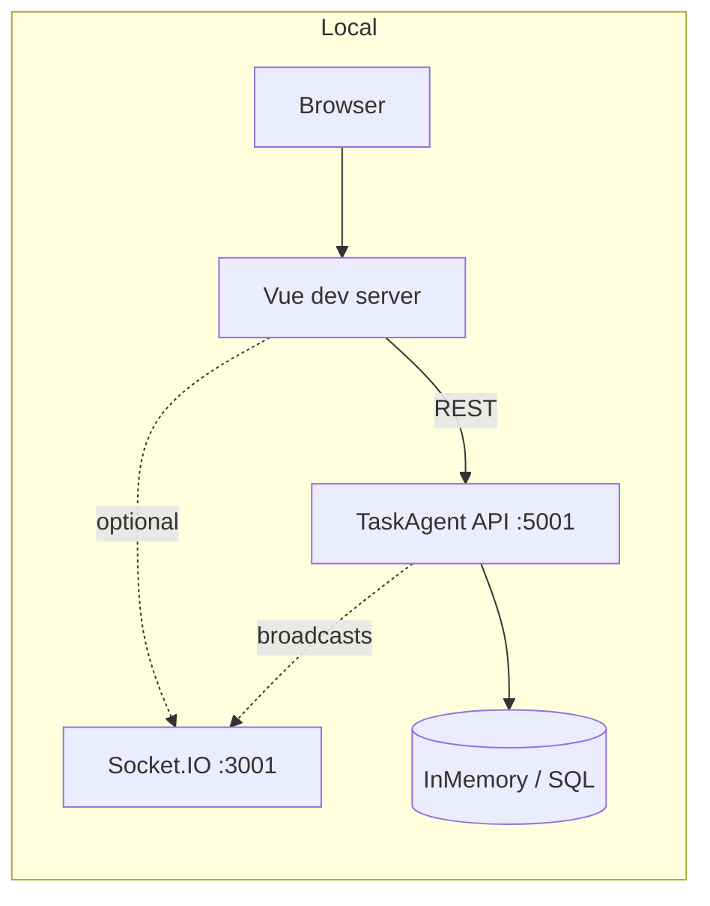

# TaskAgent

**TaskAgent** is a task management system for projects and sprints. Manage tasks in list, board, or analytics views with a responsive UI across desktop, tablet, and mobile.

## Features

| Feature | Description |
|---------|-------------|
| **Authentication** | Login, sign up, demo accounts |
| **Dashboard** | List view (table), Board view (Kanban columns), Analytics view (sprint progress, burndown, funnel, tag breakdown, workload) |
| **My Tasks** | Cross-project task view with filters (assignee, priority, project), stats |
| **Projects & Sprints** | CRUD for projects and sprints, project/sprint selectors |
| **Tasks** | Create/edit tasks, inline editing (title, assignee, due date, priority), drag-and-drop on board, tags, comments |
| **UI** | Dark/light theme, responsive layouts for desktop, tablet, mobile |
| **Real-time board** | Socket.IO server (`Backend/realtime`); task create/update/delete broadcast so multiple viewers see changes immediately. Toggleable via feature flag (Docker + frontend; off by default). |
| **Logging** | Backend request logging with correlation IDs for tracing; configurable log levels per environment |
| **Feature flags** | Realtime feature can be turned on/off via config (Docker: `REALTIME_SERVER_URL`; Frontend: `VITE_REALTIME_ENABLED`). Default: off. |

## Technologies

**Frontend**
- Vue 3, TypeScript, Vite 7
- Pinia (state), Vue Router, pinia-plugin-persistedstate
- Lucide Vue (icons)
- Vitest, Playwright (tests)

**Backend**
- ASP.NET Core 9, Entity Framework Core 9
- SQL Server (prod/staging) or InMemory (dev)
- Swagger/OpenAPI
- Azure AD / RBAC for passwordless SQL (production)

**Infrastructure**
- Docker, docker-compose (from repo root)
- GitHub Actions: `build-backend.yml`, `build-frontend.yml` (PR builds), `ci.yml` (full CI), `deploy.yml` (backend to Azure), `deploy-pages.yml` (frontend to GitHub Pages), `synthetic-tests.yml`
- Azure: Container Apps, ACR, Azure SQL
- GitHub Pages (frontend hosting)

## Architecture (local development)



## Project Structure

```
TaskAgent/
├── Backend/             # .NET API (tasks, projects, sprints, comments)
│   ├── src/
│   │   ├── TaskAgent.Api/
│   │   ├── TaskAgent.Contracts/
│   │   └── TaskAgent.DataAccess/
│   ├── realtime/        # Socket.IO server for live board updates
│   ├── postman/         # Postman collection for API
│   ├── spec.md          # API spec
│   └── tests/
├── Frontend/            # Vue.js SPA
│   ├── src/
│   │   ├── features/    # auth, dashboard, tasks, analytics
│   │   ├── components/
│   │   └── stores/
│   ├── e2e/             # Playwright tests
│   └── screenshots/     # Generated screenshots (npm run screenshots)
├── docs/                # ENV.md, LOCAL_AND_STAGING.md
├── infra/               # Azure setup, RBAC scripts
├── scripts/             # GitHub secrets, JWT Key Vault setup
├── .github/workflows/   # build-backend, build-frontend, ci, deploy, deploy-pages, synthetic-tests
├── TaskAgent.sln        # Solution at repo root
└── docker-compose.yml
```

## Quick Start (run locally)

**1. Backend (Docker)** — from repo root:

```bash
docker compose up --build api
```

API at **http://localhost:5001** (InMemory DB). Use `--profile databases` to add SQL Server / MongoDB. Realtime is **off by default**; use `--profile realtime` with `REALTIME_SERVER_URL=http://realtime:3001` in `.env` to enable.

**2. Frontend** — in another terminal:

```bash
cd Frontend && npm install && npm run dev
```

Create `Frontend/.env` from `.env.example` and set `VITE_API_BASE=http://localhost:5001` so the UI talks to the API. For clone-and-run with working login, see [CONTRIBUTING.md – First-time setup](CONTRIBUTING.md#first-time-setup-clone-and-run-with-login).

**3. Realtime (optional)** — for live board updates:

- **Via Docker:** `docker compose --profile realtime up --build` (add `REALTIME_SERVER_URL=http://realtime:3001` to `.env`)
- **Standalone:** `cd Backend/realtime && npm install && npm run dev`

Set `Realtime__ServerUrl` in backend config; in Frontend `.env` set `VITE_REALTIME_ENABLED=true` and `VITE_REALTIME_URL` (see [docs/ENV.md](docs/ENV.md)).

**Backend without Docker:** `dotnet run --project Backend/src/TaskAgent.Api` from repo root. Full env reference: [CONTRIBUTING.md](CONTRIBUTING.md), [docs/ENV.md](docs/ENV.md).

## Scripts

**Frontend**
- `npm run dev` – Dev server
- `npm run build` – Production build
- `npm run preview` – Preview production build
- `npm run screenshots` – Generate Playwright screenshots (desktop, tablet, mobile)
- `npm run test:unit` – Vitest
- `npm run test:e2e` – Playwright E2E
- `npm run lint` – Lint (oxlint + ESLint)
- `npm run format` – Format with Prettier

**Backend**
- From repo root: `docker compose up --build api` – Run API (Docker, default)
- From repo root: `dotnet run --project Backend/src/TaskAgent.Api` – Run API (without Docker)
- From repo root: `dotnet test TaskAgent.sln` – Run tests

**Realtime**
- `cd Backend/realtime && npm run dev` – Socket.IO server (default port 3001)

## Database Schema

Below is a high-level overview of the core domain models used by TaskAgent. The primary entities are stored in either an in-memory store (development), MongoDB, or SQL Server, depending on configuration.  
**Most entities include an `IsDeleted` boolean field for soft deletes.**

### **Task**

| Field         | Type     | Description                                                                            |
|---------------|----------|----------------------------------------------------------------------------------------|
| Id            | string   | Unique identifier (GUID)                                                               |
| Title         | string   | Task title                                                                             |
| Description   | string   | Task details (optional)                                                                |
| Status        | string   | Status (e.g., "To Do", "In Progress", "Done")                                          |
| Priority      | int      | Priority (optional)                                                                    |
| AssigneeId    | string   | Reference to User (foreign key: the user assigned to this task; optional)              |
| BoardId       | string   | Reference to Board (foreign key: the board containing this task)                       |
| SprintId      | string   | Reference to Sprint (foreign key: the sprint this task belongs to; optional)           |
| IsDeleted     | bool     | Soft-delete flag (true if deleted)                                                     |
| CreatedAt     | DateTime | Timestamp when created                                                                 |
| UpdatedAt     | DateTime | Timestamp when last updated                                                            |

### **Board**

| Field       | Type     | Description                                                                                                  |
|-------------|----------|--------------------------------------------------------------------------------------------------------------|
| Id          | string   | Unique identifier (GUID)                                                                                     |
| Name        | string   | Board name                                                                                                   |
| ProjectId   | string   | Reference to Project (foreign key: the project this board belongs to)                                        |
| OwnerId     | string   | Reference to User (foreign key: the user who owns this board)                                                |
| IsDeleted   | bool     | Soft-delete flag                                                                                             |
| CreatedAt   | DateTime | Creation timestamp                                                                                           |
| UpdatedAt   | DateTime | Last modified timestamp                                                                                      |

### **Project**

| Field       | Type     | Description                                                                    |
|-------------|----------|--------------------------------------------------------------------------------|
| Id          | string   | Unique identifier (GUID)                                                       |
| Name        | string   | Project name                                                                   |
| Description | string   | Project description (optional)                                                 |
| OwnerId     | string   | Reference to User (foreign key: the user who owns this project)                |
| IsDeleted   | bool     | Soft-delete flag                                                               |
| CreatedAt   | DateTime | Creation timestamp                                                             |
| UpdatedAt   | DateTime | Last modified timestamp                                                        |

### **Sprint**

| Field       | Type     | Description                                                        |
|-------------|----------|--------------------------------------------------------------------|
| Id          | string   | Unique identifier (GUID)                                           |
| Name        | string   | Sprint name                                                        |
| ProjectId   | string   | Reference to Project (foreign key: the project this sprint belongs to) |
| StartDate   | DateTime | Sprint start date                                                  |
| EndDate     | DateTime | Sprint end date                                                    |
| IsDeleted   | bool     | Soft-delete flag                                                   |
| CreatedAt   | DateTime | Creation timestamp                                                 |
| UpdatedAt   | DateTime | Last modified timestamp                                            |

### **Comment**

| Field       | Type     | Description                                                                                       |
|-------------|----------|---------------------------------------------------------------------------------------------------|
| Id          | string   | Unique identifier (GUID)                                                                          |
| TaskId      | string   | Reference to Task (foreign key: the task this comment belongs to)                                 |
| UserId      | string   | Reference to User (foreign key: the author of the comment)                                        |
| Content     | string   | Comment content                                                                                   |
| CreatedAt   | DateTime | Creation timestamp                                                                                |
| UpdatedAt   | DateTime | Last modified timestamp                                                                           |
| IsDeleted   | bool     | Soft-delete flag                                                                                  |

### **User**

| Field        | Type     | Description                                         |
|--------------|----------|-----------------------------------------------------|
| Id           | string   | Unique identifier (GUID)                            |
| Name         | string   | User's display name                                 |
| Email        | string   | Email address                                       |
| PasswordHash | string   | Hashed password                                     |
| Role         | string   | User role (e.g., "User", "Admin")                   |
| IsDeleted    | bool     | Soft-delete flag                                    |
| CreatedAt    | DateTime | Creation timestamp                                  |
| UpdatedAt    | DateTime | Last modified timestamp                             |

## User flows

**Authentication**
- Login (email + password); sign up (name, email, password); log out.
- Demo accounts: pick a demo user, password pre-filled; submit to sign in.
- Profile page (placeholder; no settings flow yet).

**Dashboard (project/sprint context)**
- Empty state: no projects → "Create your first project" → create project form.
- Select project and sprint from header; create project (ProjectSelector) or create sprint (SprintSelector).
- Switch view: List (table), Board (Kanban), or Analytics; preference stored in `localStorage`.

**Tasks**
- Create task ("New Task" → form); edit task (open form or inline: title, assignee, due date, priority); delete task (with confirmation).
- Board: drag-and-drop task between columns (To Do / In Progress / Done); status updated on drop.
- Filter and sort tasks (assignee, priority; sort by title, status, priority, assignee, due date, size).
- Add and view comments on a task (in task form); project-level comment list in Analytics view.

**My Tasks**
- View tasks assigned to current user across projects; filter by project, status, priority; open/edit/delete same as dashboard.

**Project settings**
- Edit project: name, description, color, dates, owner, sprint duration, task size unit, visible board columns, visibility (who can see project).
- Delete project (danger zone; soft-deletes project and its tasks/sprints).

**Sprints**
- Create sprint (name, goal, start date); start sprint (planning → active; one active per project); complete sprint.

**UI / global**
- Toggle dark/light theme (user menu); responsive layout (desktop, tablet, mobile).
- With realtime server: board subscribes to project/sprint; task create/update/delete broadcast to other viewers.

## Trade-offs and assumptions

**Trade-offs**

| Area | Choice | Trade-off |
|------|--------|-----------|
| **Data store** | InMemory (dev) / SQL Server (prod) / optional MongoDB | Single backend supports multiple stores; schema and query patterns are tuned for relational use. Using MongoDB or InMemory means some SQL-specific features (e.g. rich migrations) are not used the same way. |
| **Realtime** | Optional Socket.IO server | Keeps the main API stateless and simple; realtime is best-effort and not required for core CRUD. Adds an extra process and configuration to run. |
| **Auth** | JWT in app; optional Azure AD for SQL | JWT is simple for SPA + API; no built-in refresh tokens or session revocation. Production SQL can use Azure AD RBAC instead of connection strings. |
| **Soft deletes** | `IsDeleted` on entities | Keeps history and referential integrity without hard deletes; list and board queries must filter deleted rows. |
| **Frontend** | SPA (Vue) with REST + optional WebSocket | Fast UX and clear separation from API; SEO and first-load are secondary to app-like experience. |

**Assumptions**

- **Audience:** Small to medium teams; single-tenant or simple multi-tenant usage. No built-in org/workspace hierarchy or SSO.
- **Scale:** Read/write volume and board concurrency are modest. InMemory is for dev only; production assumes a persistent store (SQL or Mongo) and a single API instance unless you add load balancing yourself.
- **Environment:** Backend expects config via appsettings or env vars (e.g. `Jwt__Key`, `ConnectionStrings__SqlDb`, `Realtime__ServerUrl`). Frontend expects `VITE_API_BASE` (and optionally `VITE_REALTIME_ENABLED` + `VITE_REALTIME_URL` for realtime).
- **Browser:** Modern browsers with JavaScript enabled; no hard requirement for offline or legacy browsers.

---

For an evaluation-focused overview (architecture, trade-offs, frontend–backend communication, production considerations), see [Evaluation Guide](EVALUATION_GUIDE.md).
