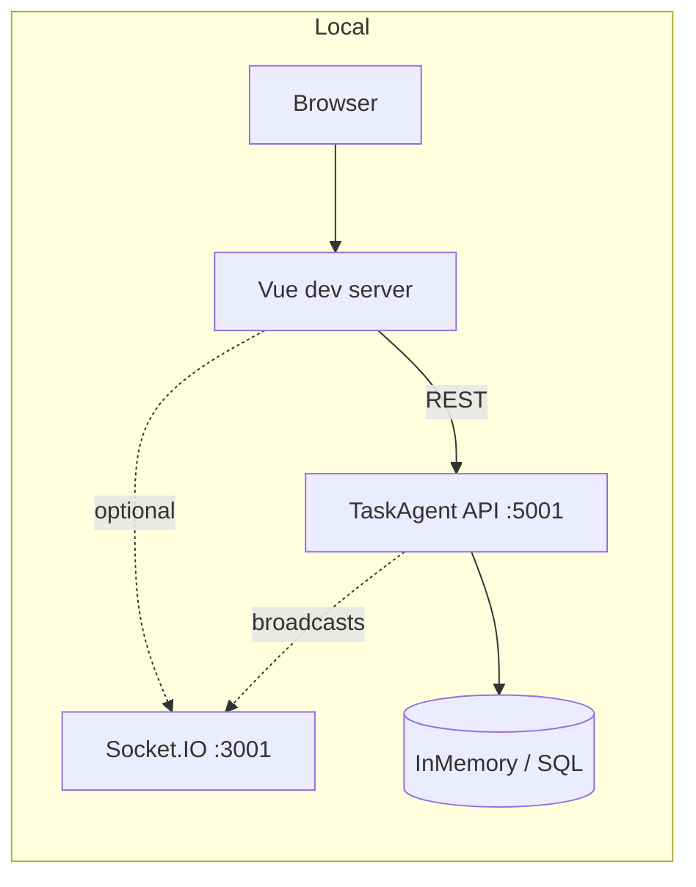

# TaskAgent

**TaskAgent** is a task management system for projects and sprints. Manage tasks in list, board, or analytics views with a responsive UI across desktop, tablet, and mobile.

## Features

| Feature | Description |
|---------|-------------|
| **Authentication** | Login, sign up, demo accounts |
| **Dashboard** | List view (table), Board view (Kanban columns), Analytics view (sprint progress, burndown, funnel, tag breakdown, workload) |
| **My Tasks** | Cross-project task view with filters (assignee, priority, project), stats |
| **Projects & Sprints** | CRUD for projects and sprints, project/sprint selectors |
| **Tasks** | Create/edit tasks, inline editing (title, assignee, due date, priority), drag-and-drop on board, tags, comments |
| **UI** | Dark/light theme, responsive layouts for desktop, tablet, mobile |
| **Real-time board** | Socket.IO server (`Backend/realtime`); task create/update/delete broadcast so multiple viewers see changes immediately |

## Technologies

**Frontend**
- Vue 3, TypeScript, Vite 7
- Pinia (state), Vue Router, pinia-plugin-persistedstate
- Lucide Vue (icons)
- Vitest, Playwright (tests)

**Backend**
- ASP.NET Core 9, Entity Framework Core 9
- SQL Server (prod/staging) or InMemory (dev)
- Swagger/OpenAPI
- Azure AD / RBAC for passwordless SQL (production)

**Infrastructure**
- Docker, docker-compose (from repo root)
- GitHub Actions: `build-backend.yml`, `build-frontend.yml` (PR builds), `ci.yml` (full CI), `deploy.yml` (backend to Azure), `deploy-pages.yml` (frontend to GitHub Pages), `synthetic-tests.yml`
- Azure: Container Apps, ACR, Azure SQL
- GitHub Pages (frontend hosting)

## Architecture (local development)



## Project Structure

```
TaskAgent/
├── Backend/             # .NET API (tasks, projects, sprints, comments)
│   ├── src/
│   │   ├── TaskAgent.Api/
│   │   ├── TaskAgent.Contracts/
│   │   └── TaskAgent.DataAccess/
│   ├── realtime/        # Socket.IO server for live board updates
│   ├── postman/         # Postman collection for API
│   ├── spec.md          # API spec
│   └── tests/
├── Frontend/            # Vue.js SPA
│   ├── src/
│   │   ├── features/    # auth, dashboard, tasks, analytics
│   │   ├── components/
│   │   └── stores/
│   ├── e2e/             # Playwright tests
│   └── screenshots/     # Generated screenshots (npm run screenshots)
├── docs/                # ENV.md, LOCAL_AND_STAGING.md
├── infra/               # Azure setup, RBAC scripts
├── scripts/             # GitHub secrets, JWT Key Vault setup
├── .github/workflows/   # build-backend, build-frontend, ci, deploy, deploy-pages, synthetic-tests
├── TaskAgent.sln        # Solution at repo root
└── docker-compose.yml
```

## Quick Start (run locally)

**1. Backend (Docker)** — from repo root:

```bash
docker compose up --build api
```

API at **http://localhost:5001** (InMemory DB). Use `--profile databases` to add SQL Server / MongoDB.

**2. Frontend** — in another terminal:

```bash
cd Frontend && npm install && npm run dev
```

Create `Frontend/.env` from `.env.example` and set `VITE_API_BASE=http://localhost:5001` so the UI talks to the API. For clone-and-run with working login, see [CONTRIBUTING.md – First-time setup](CONTRIBUTING.md#first-time-setup-clone-and-run-with-login).

**3. Realtime (optional)** — for live board updates:

```bash
cd Backend/realtime && npm install && npm run dev
```

Set `Realtime__ServerUrl` in backend config and `VITE_REALTIME_URL` in Frontend `.env` (see [docs/ENV.md](docs/ENV.md)).

**Backend without Docker:** `dotnet run --project Backend/src/TaskAgent.Api` from repo root. Full env reference: [CONTRIBUTING.md](CONTRIBUTING.md), [docs/ENV.md](docs/ENV.md).

## Scripts

**Frontend**
- `npm run dev` – Dev server
- `npm run build` – Production build
- `npm run preview` – Preview production build
- `npm run screenshots` – Generate Playwright screenshots (desktop, tablet, mobile)
- `npm run test:unit` – Vitest
- `npm run test:e2e` – Playwright E2E
- `npm run lint` – Lint (oxlint + ESLint)
- `npm run format` – Format with Prettier

**Backend**
- From repo root: `docker compose up --build api` – Run API (Docker, default)
- From repo root: `dotnet run --project Backend/src/TaskAgent.Api` – Run API (without Docker)
- From repo root: `dotnet test TaskAgent.sln` – Run tests

**Realtime**
- `cd Backend/realtime && npm run dev` – Socket.IO server (default port 3001)

## Environment variables

See [docs/ENV.md](docs/ENV.md) for a single reference of all environment variables used by the backend, frontend, and realtime server.

**Backend (appsettings or env)**  
`ConnectionStrings__SqlDb`, `Cors__AllowedOrigins`, `Realtime__ServerUrl`, `Jwt__Key` (required for auth in staging/production)

**Frontend (`.env` or build-time)**  
`VITE_API_BASE`, `VITE_REALTIME_URL` (optional)

**Local and staging setup:** For a step-by-step checklist so the app works both locally and in staging (JWT, CORS, env vars), see [docs/LOCAL_AND_STAGING.md](docs/LOCAL_AND_STAGING.md).

---

For an evaluation-focused overview (architecture, trade-offs, frontend–backend communication, production considerations), see [Evaluation Guide](EVALUATION_GUIDE.md).
