# TaskAgent

**TaskAgent** is a task management system for projects and sprints. Manage tasks in list, board, or analytics views with a responsive UI across desktop, tablet, and mobile.

## Features

| Feature | Description |
|---------|-------------|
| **Authentication** | Login, sign up, demo accounts |
| **Dashboard** | List view (table), Board view (Kanban columns), Analytics view (sprint progress, burndown, funnel, tag breakdown, workload) |
| **My Tasks** | Cross-project task view with filters (assignee, priority, project), stats |
| **Projects & Sprints** | CRUD for projects and sprints, project/sprint selectors |
| **Tasks** | Create/edit tasks, inline editing (title, assignee, due date, priority), drag-and-drop on board, tags, comments |
| **UI** | Dark/light theme, responsive layouts for desktop, tablet, mobile |
| **File attachments** | Via File Service (local or Azure Blob) |

## Technologies

**Frontend**
- Vue 3, TypeScript, Vite 7
- Pinia (state), Vue Router, pinia-plugin-persistedstate
- Lucide Vue (icons)
- Vitest, Playwright (tests)

**Backend**
- ASP.NET Core 9, Entity Framework Core 9
- SQL Server (prod/staging) or InMemory (dev)
- Swagger/OpenAPI
- Azure AD / RBAC for passwordless SQL (production)

**File Service**
- ASP.NET Core, Azure Blob Storage or local filesystem

**Infrastructure**
- Docker, docker-compose
- GitHub Actions (deploy-backend, deploy-pages)
- Azure: Container Apps, ACR, Azure SQL
- GitHub Pages (frontend hosting)

## Architecture

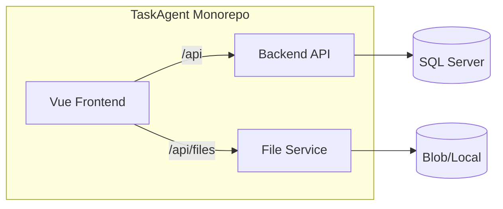

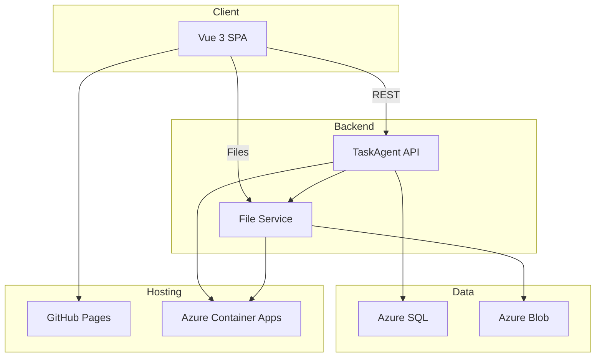

## Screenshots

### Desktop

| Auth (Light) | Auth (Dark) | Dashboard List |
|--------------|-------------|----------------|
| 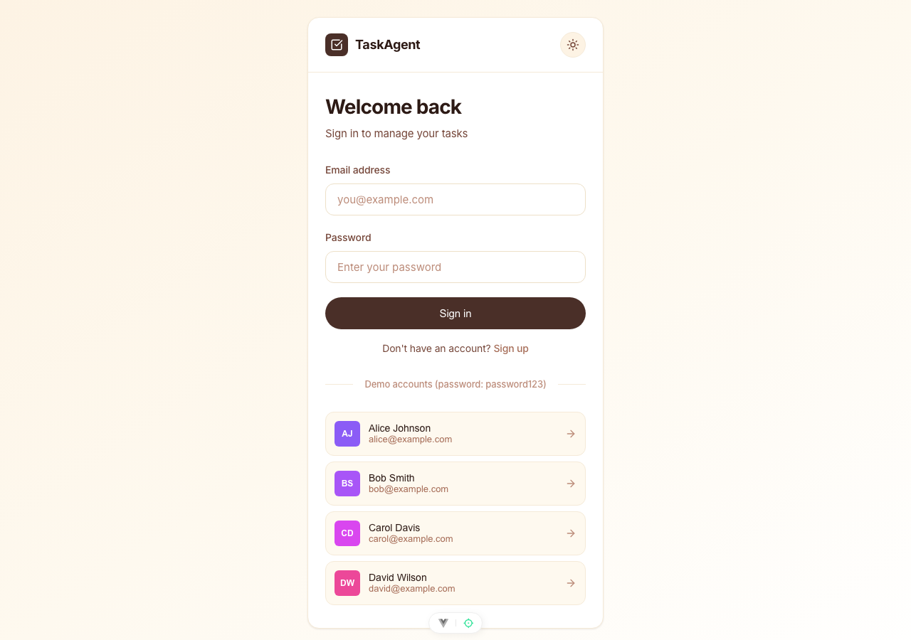 | 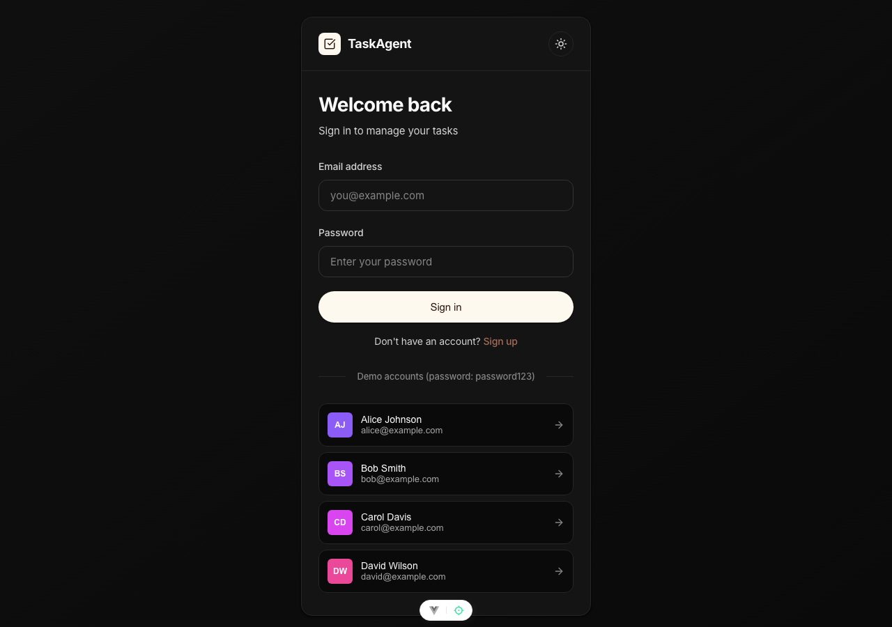 | 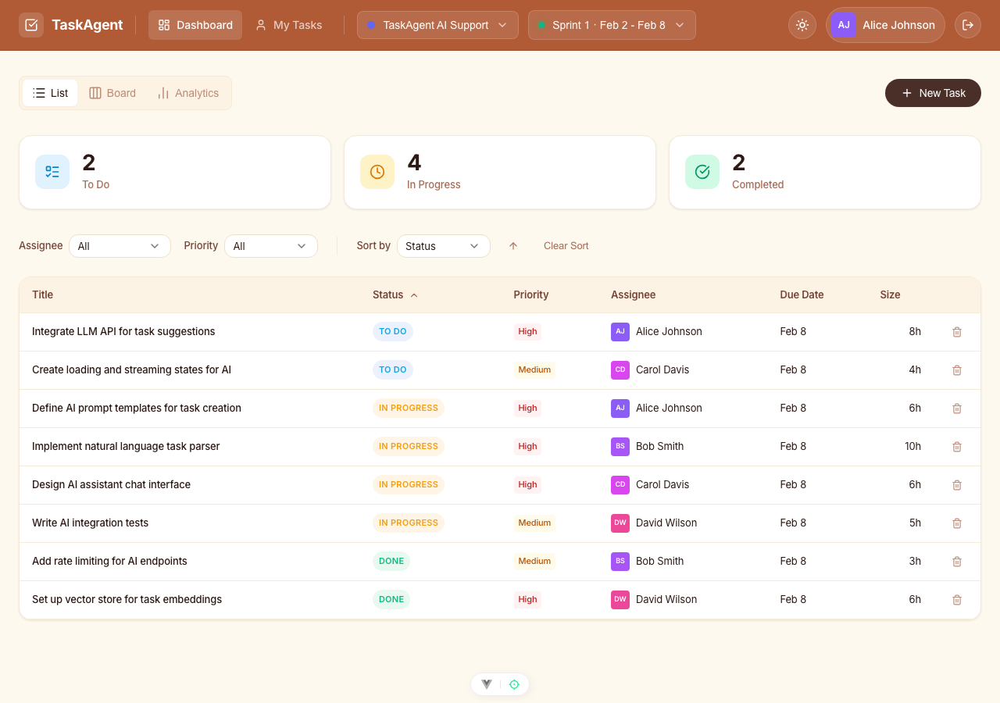 |

| Dashboard Board | Dashboard Analytics | Task Form |
|-----------------|---------------------|-----------|
| 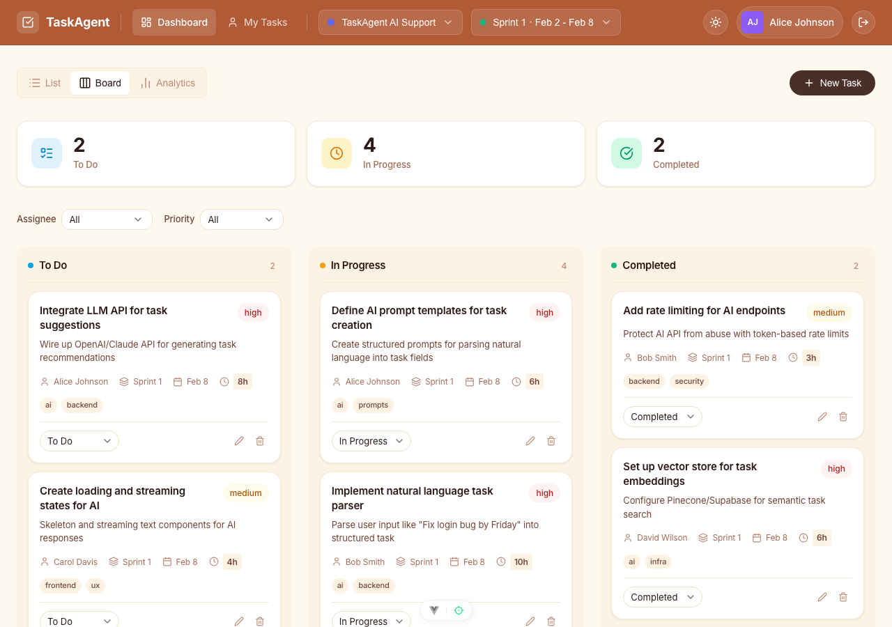 | 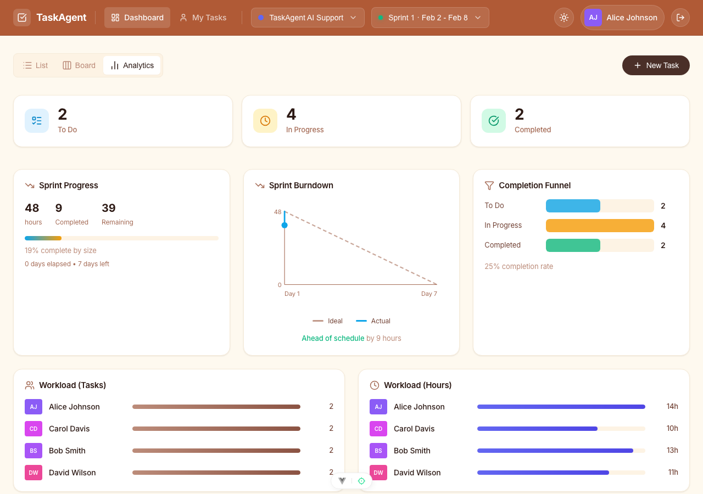 | 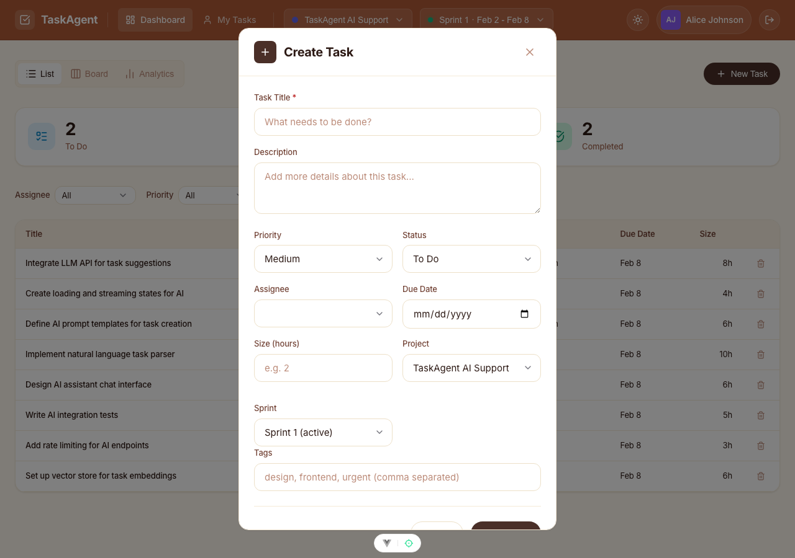 |

| My Tasks |
|----------|
| 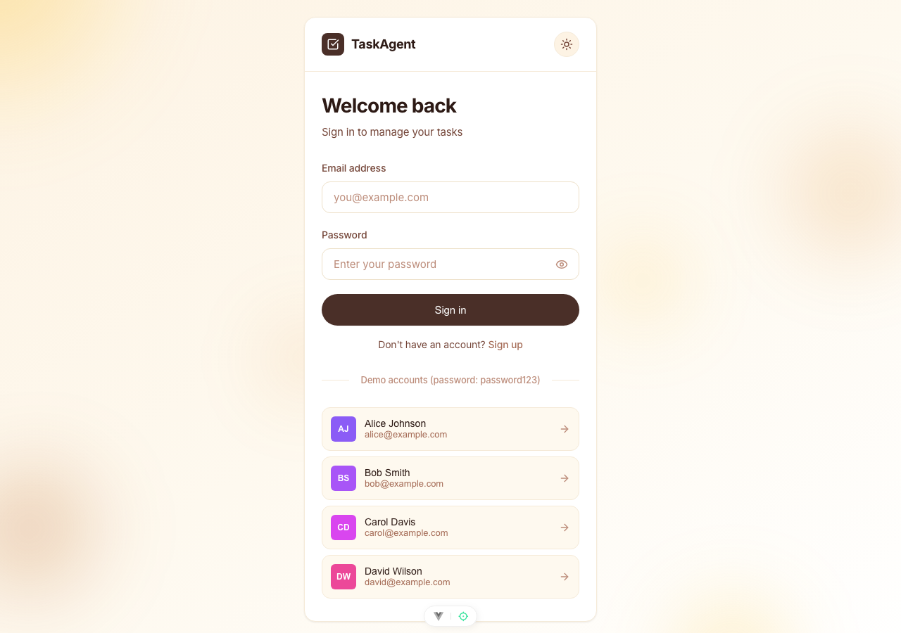 |

### Mobile

| Login | Dashboard |
|-------|-----------|
| 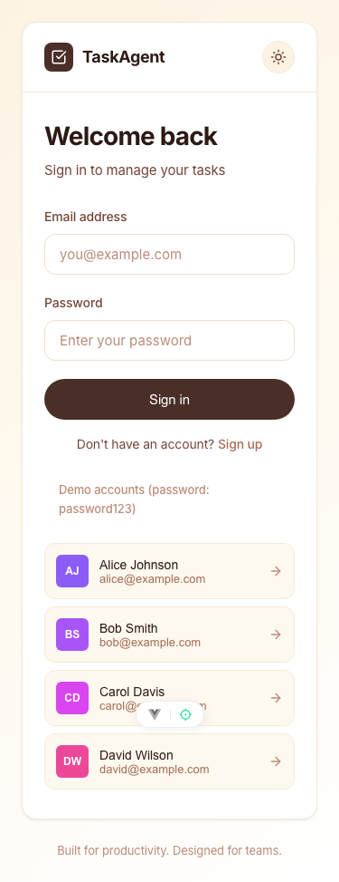 | 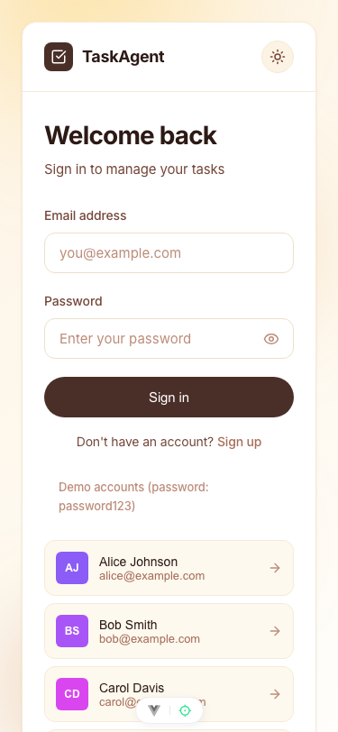 |

## Project Structure

```
TaskAgent/
├── Backend/           # .NET API (tasks, projects, sprints, comments)
│   ├── src/
│   │   ├── TaskAgent.Api/
│   │   ├── TaskAgent.Contracts/
│   │   └── TaskAgent.DataAccess/
│   ├── infra/         # Azure setup, RBAC scripts
│   └── tests/
├── Frontend/          # Vue.js SPA
│   ├── src/
│   │   ├── features/  # auth, dashboard, tasks, analytics
│   │   ├── components/
│   │   └── stores/
│   ├── e2e/           # Playwright tests
│   └── screenshots/   # Generated screenshots by device/feature
├── FileService/       # Standalone file storage (local or Azure Blob)
├── .github/workflows/ # deploy-backend.yml, deploy-pages.yml
└── docker-compose.yml
```

## Quick Start

### Run with Docker

```bash
docker compose up --build
```

- **API**: http://localhost:5001
- **File Service**: http://localhost:5002
- **Web (nginx)**: http://localhost:80 – serves the UI and proxies `/api` to the API and `/api/files` to File Service

### Run locally (development)

**Backend:**
```bash
cd Backend && dotnet run --project src/TaskAgent.Api
```

**File Service:**
```bash
cd FileService && dotnet run
```

**Frontend:**
```bash
cd Frontend && npm install && npm run dev
```

Set `VITE_API_BASE=http://localhost:5001` in Frontend `.env` for local API. File uploads go to File Service at port 5002 when using `VITE_FILE_SERVICE_URL` (or configure proxy).

## Scripts

**Frontend**
- `npm run dev` – Start dev server
- `npm run build` – Production build
- `npm run screenshots` – Generate Playwright screenshots (desktop, tablet, mobile)
- `npm run test:unit` – Vitest
- `npm run test:e2e` – Playwright E2E

**Backend**
- `dotnet run --project src/TaskAgent.Api` – Run API
- `dotnet test` – Run tests

## Deployment

- **Backend**: Deployed to Azure Container Apps via GitHub Actions (see `.github/workflows/deploy-backend.yml`). Uses Azure AD / RBAC for passwordless SQL access.
- **Frontend**: Deployed to GitHub Pages via `.github/workflows/deploy-pages.yml`. See [DEPLOY-TO-GITHUB-PAGES.md](DEPLOY-TO-GITHUB-PAGES.md) for setup.
